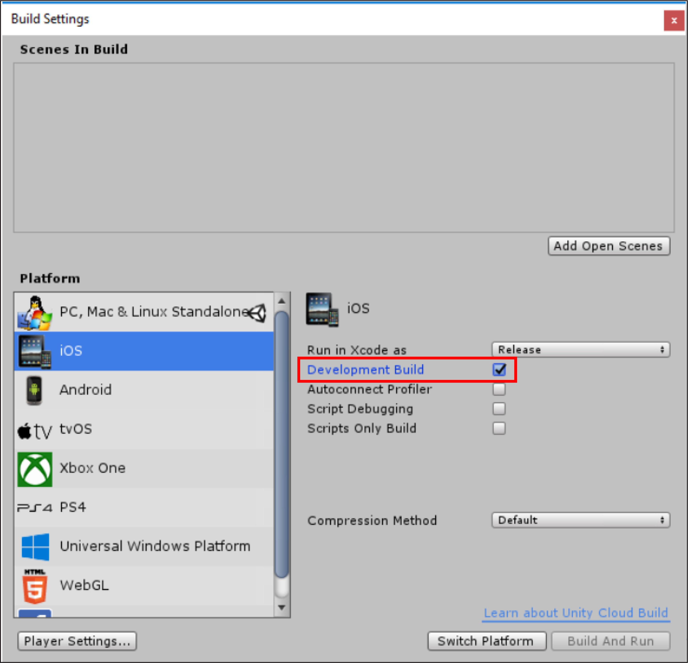

# Configuring your Project for Unity Remote Config

## Requirements

* Unity Remote Config requires Unity version 2018.3 or higher.
* Set your [Editor scripting runtime](https://docs.unity3d.com/2018.4/Documentation/Manual/ScriptingRuntimeUpgrade.html) to **.NET 4.X Equivalent** (or above).
* [Enable Unity Services](https://docs.unity3d.com/2019.3/Documentation/Manual/SettingUpProjectServices.html) for your Project.
* Install the Remote Config package (detailed below).  

## Installing the Remote Config package

See documentation on [packages](https://docs.unity3d.com/2019.3/Documentation/Manual/Packages.html) for more information on working with packages in a Project. These steps may vary depending on which version of the Unity Editor you’re using. 

### Verified Release

1. In the Unity Editor, select **Window** > **Package Manager**.
2. From the Package Manager Window find Remote Config in the Packages List View and select it
3. In the Package Specific Detail View select the version and install to import the package into your Project

### Preview Release
1. In the Package Manager Window the **Advanced** button will allow you to toggle **Preview Packages** making them visable in the Package List View
2. Follow the instructions for the Verified Release Installation (directly above this section)

### Beta Customers
Upon receiving the Remote Config package from your account manager, follow these steps:

1. Download and unzip the package.
2. In the Unity Editor, select **Window** > **Package Manager**.
3. Click the plus (**+**) button at the bottom of the Package Manager window to open the **Add package from disk...** dialog.
4. Locate the _package.json_ file inside your unzipped copy of the Remote Config package.
5. Click **Open** to import the package into your Project.

## Remote Config build environments
The Remote Config service includes two build environments:

### Development environment 
Remote Config sends settings from the Development environment to builds marked as development builds. 

**Note**: For Unity to request the Development environment settings, you must check the **Development Build** setting in the [Build Settings window](https://docs.unity3d.com/2019.3/Documentation/Manual/BuildSettings.html) when building your application. 

### Release environment
Remote Config sends settings from the Release environment to any non-development builds.

**Note**: The Editor’s Play mode always uses the Development environment settings.

Once you’ve configured your Project, start configuring your [Rules and Settings](RulesAndSettings.md) in the **Remote Config** window.
